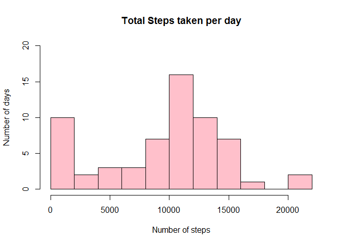
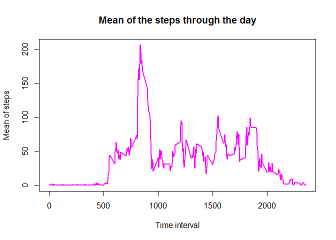
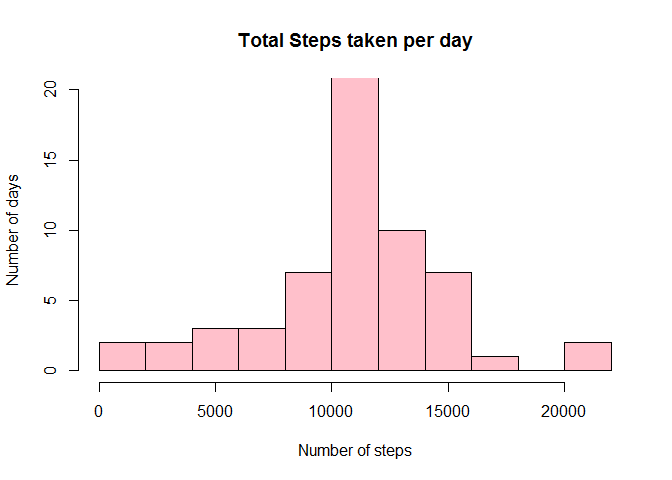
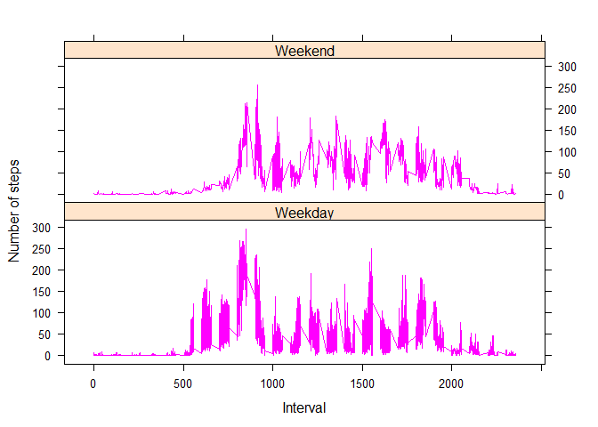

# Reproducible Research: Peer Assessment 1
####Esther Fernández
####2106-02-24

## Introduction
This assignment makes use of data from a personal activity monitoring device. This device collects data at 5 minute intervals through out the day. The data consists of two months of data from an anonymous individual collected during the months of October and November, 2012 and include the number of steps taken in 5 minute intervals each day.

## Data
The data for this assignment can be downloaded from the course web site:

Dataset: [Activity monitoring data (52K)](https://github.com/Esferque/RepData_PeerAssessment1/blob/master/activity.zip)

The variables included in this dataset are:

* **steps**: Number of steps taking in a 5-minute interval (missing values are coded as NA)
* **date**: The date on which the measurement was taken in YYYY-MM-DD format
* **interval**: Identifier for the 5-minute interval in which measurement was taken

The dataset is stored in a comma-separated-value (CSV) file and there are a total of 17,568 observations in this dataset.

 
## Loading and preprocessing the data
We assume that the reader set the correct R working directory with the setwd() function.
#### 1) Load the data

```r
#Clear the workspace
rm(list=ls())

#Load the raw data
rawData <- read.csv("activity.csv", header = TRUE, sep = ",", stringsAsFactors = FALSE)
```

#### 2) Process/Transform the data to let it ready for the analysis

```r
# Put the date into a date format
rawData$date <- as.POSIXct(rawData$date, format="%Y-%m-%d")

# Include a column with the weeekday and another with the type of day (if it is weekend or not):
rawData <- cbind(rawData, weekday = weekdays(rawData$date))
rawData <- cbind(rawData, daytype = ifelse(rawData$weekday=="domingo" | rawData$weekday=="sábado","Weekend","Weekday"))

# So, our trasnformed data set will be (just order the columns):
activityData <- data.frame(date=rawData$date,
                           weekday = rawData$weekday,
                           daytype = rawData$daytype,
                           interval = rawData$interval,
                           steps = rawData$steps)

# Now, we can remove the rawData:
rm(rawData)
```


## What is mean total number of steps taken per day?
For this part we can ignore the missing values.

#### 1) Calculate the total number of steps taken per day

```r
#Calculate the number of steps taken per day using the 'aggregate' funtion
daySteps <- aggregate(x=activityData$steps, by = list(activityData$date), FUN = sum, na.rm=TRUE)

#Rename the columns
names(daySteps) <- c("date", "total_steps")
```

#### 2) Make an histogram with the total of steps per day

```r
# Use the function 'hist' to plot the histogram
hist(daySteps$total_steps, breaks= 12, ylim =c(0,20), 
     xlab = "Number of steps", 
     ylab = "Number of days", main = "Total Steps taken per day", 
     col = "pink")
```



#### 3) Calculate the mean and the median of the number of steps taken per day

```r
meanTotalSteps <- mean(daySteps$total_steps)
medianTotalSteps <- median(daySteps$total_steps)
```
So, the **mean** is 9354.23 steps and the **median** is 10395 steps. 


## What is the average daily activity pattern?

#### 1) Make a time series plot (i.e. type = "l") of the 5-minute interval (x-axis) and the average number of steps taken, averaged across all days (y-axis)

```r
rm(daySteps)
rm(meanTotalSteps)
rm(medianTotalSteps)

# First we Compute the mean of steps accross all days for each interval
stepsMeanByInterval <- aggregate(x = activityData$steps,
                          by = list(activityData$interval),
                          FUN = mean, na.rm = TRUE) 
names(stepsMeanByInterval) <- c("inteval", "mean")
head(stepsMeanByInterval)
```

```
##   inteval      mean
## 1       0 1.7169811
## 2       5 0.3396226
## 3      10 0.1320755
## 4      15 0.1509434
## 5      20 0.0754717
## 6      25 2.0943396
```

```r
tail(stepsMeanByInterval)
```

```
##     inteval      mean
## 283    2330 2.6037736
## 284    2335 4.6981132
## 285    2340 3.3018868
## 286    2345 0.6415094
## 287    2350 0.2264151
## 288    2355 1.0754717
```

```r
# Then, we make the plot,
plot(stepsMeanByInterval$inteval,stepsMeanByInterval$mean, 
     type = "l", col = "magenta", lwd = 2,
     xlab = "Time interval",
     ylab = "Mean of steps",
     main = "Mean of the steps through the day")
```



#### 2) Which 5-minute interval, on average across all the days in the dataset, contains the maximum number of steps?

```r
#Find the position of the maximum mean
maxMean <- which(stepsMeanByInterval$mean==max(stepsMeanByInterval$mean))

#Then look for the interval that conteins this value
int <- stepsMeanByInterval[maxMean,1]

#Clear workspace
rm(maxMean)
rm(int)
```
So, The 5-minute interval that contains the maximum of steps, on average across all days, is 835 (which means 8 hours 35 min).

## Imputing missing values
Note that there are a number of days/intervals where there are missing values (coded as NA). The presence of missing days may introduce bias into some calculations or summaries of the data.

#### 1) Calculate and report the total number of missing values in the dataset (i.e. the total number of rows with NAs)

```r
count <- sum(is.na(activityData$steps))

#Clear workspace
rm(count)
```
And we get **2304** missing values.

#### 2) Devise a strategy for filling in all of the missing values in the dataset. The strategy does not need to be sophisticated. For example, you could use the mean/median for that day, or the mean for that 5-minute interval, etc.

So, the strategy of imputing the mean of the 5 min interval across the days.

```r
#Find the NA's positions
naPos <- which(is.na(activityData$steps))

#Create the vector to imput the missing values
means <- rep(stepsMeanByInterval$mean, 61)
```

#### 3) Create a new dataset that is equal to the original dataset but with the missing data filled in.

```r
#Replace the NAs by the means
activityData[naPos,"steps"] <- means[naPos]

#Clear workspace
rm(naPos)
rm(means)
rm(stepsMeanByInterval)
```

#### 4) Make a histogram of the total number of steps taken each day and Calculate and report the **mean** and **median** total number of steps taken per day. Do these values differ from the estimates from the first part of the assignment? What is the impact of imputing missing data on the estimates of the total daily number of steps?

```r
#Redo the first step with the modificated data set

#Calculate the number of steps taken per day using the 'aggregate' funtion
daySteps <- aggregate(x=activityData$steps, by = list(activityData$date), FUN = sum, na.rm=TRUE)

#Rename the columns
names(daySteps) <- c("date", "total_steps")

# Use the function 'hist' to plot the histogram
hist(daySteps$total_steps, breaks= 12, ylim =c(0,20), 
     xlab = "Number of steps", 
     ylab = "Number of days", main = "Total Steps taken per day", 
     col = "pink")
```



```r
# Recalculating the mean and the median:
meanTotalSteps <- mean(daySteps$total_steps)
medianTotalSteps <- median(daySteps$total_steps)
```
So, the new **mean** is 10766.1 steps and the new **median** is 10766.19 steps. Those values differ greatly from the initial values that we estimated. This is not surprising due to there were a great quantity of missing values (2304).


## Are there differences in activity patterns between weekdays and weekends?

We have already prepared our data set for this part, using the function weekdays(). We must Use the dataset with the filled-in missing values for this part.

#### 1) Create a new factor variable in the dataset with two levels - "weekday" and "weekend" indicating whether a given date is a weekday or weekend day.

We have already done it!

```r
#Clear workspace
rm(daySteps)
rm(meanTotalSteps)
rm(medianTotalSteps)

#Look at the data
head(activityData)
```

```
##         date weekday daytype interval     steps
## 1 2012-10-01   lunes Weekday        0 1.7169811
## 2 2012-10-01   lunes Weekday        5 0.3396226
## 3 2012-10-01   lunes Weekday       10 0.1320755
## 4 2012-10-01   lunes Weekday       15 0.1509434
## 5 2012-10-01   lunes Weekday       20 0.0754717
## 6 2012-10-01   lunes Weekday       25 2.0943396
```
 
#### 2) Make a panel plot containing a time series plot (i.e. type = "l") of the 5-minute interval (x-axis) and the average number of steps taken, averaged across all weekday days or weekend days (y-axis).

```r
# Load the lattice graphical library
library(lattice)

# Compute the average number of steps taken, averaged across all daytype variable
meanBydayType <- aggregate(activityData$steps, 
                       by=list(activityData$daytype, 
                               activityData$weekday, activityData$interval), mean)

#Rename the columns
names(meanBydayType) <- c("daytype", "weekday", "interval", "mean")

head(meanBydayType)
```

```
##   daytype   weekday interval      mean
## 1 Weekend   domingo        0 0.2146226
## 2 Weekday    jueves        0 5.4129979
## 3 Weekday     lunes        0 1.4926625
## 4 Weekday    martes        0 0.0000000
## 5 Weekday miércoles        0 3.9685535
## 6 Weekend    sábado        0 0.2146226
```

```r
#To do the plot:
xyplot(mean ~ interval | daytype, meanBydayType, 
       type="l", 
       lwd=1,
       col="magenta",
       xlab="Interval", 
       ylab="Number of steps", 
       layout=c(1,2))
```



